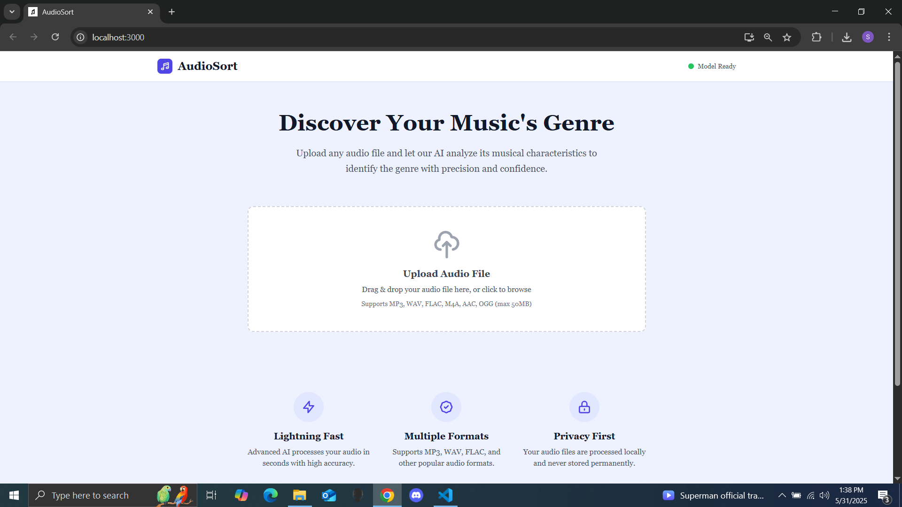

# 🎵 AudioSort - AI Music Genre Classifier

A modern web application that uses deep learning to classify music genres from audio files. Built with PyTorch for the AI model and React for the frontend interface.



  

## 🚀 Features

- **AI-Powered Classification**: Deep neural network trained on audio features
- **Multiple Audio Formats**: Supports MP3, WAV, FLAC, M4A, AAC, OGG
- **Real-time Analysis**: Fast genre prediction with confidence scores
- **Modern UI**: Clean, responsive React interface with drag & drop
- **CUDA Support**: GPU acceleration for faster processing
- **Privacy First**: Audio files processed locally, not stored permanently

## 🎯 Supported Genres

Blues • Classical • Country • Disco • Hip-Hop • Jazz • Metal • Pop • Reggae • Rock

## 🔧 Technology Stack

**Backend:** Python, PyTorch, Flask, Librosa, Scikit-learn  
**Frontend:** React, Tailwind CSS, React Dropzone

## 📋 Prerequisites

- Python 3.8+
- Node.js 16+
- 8GB+ RAM recommended
- 5GB+ free disk space

## 🚀 Quick Start

### 1. Clone the Repository

```bash
git clone https://github.com/shreyaupretyy/music-genre-classifier.git
cd music-genre-classifier
```

### 2. Download Dataset from Kaggle

1. **Visit Kaggle Dataset:**
   - Go to [GTZAN Dataset on Kaggle](https://www.kaggle.com/datasets/andradaolteanu/gtzan-dataset-music-genre-classification)
   - Click "Download" button (requires Kaggle account)

2. **Extract Dataset:**
```bash
# Extract the downloaded zip file
unzip gtzan-dataset-music-genre-classification.zip

# Create backend data directory
mkdir -p backend/data

# Move genres folder
mv Data/genres_original backend/data/genres

# Verify structure
ls backend/data/genres/
# Should show: blues, classical, country, disco, hiphop, jazz, metal, pop, reggae, rock
```

### 3. Backend Setup

```bash
cd backend

# Create virtual environment
python -m venv venv

# Activate virtual environment
# Windows: venv\Scripts\activate
# Linux/Mac: source venv/bin/activate

# Install dependencies
pip install -r requirements.txt

# Train the model (10-30 minutes)
python train_model.py

# Start Flask server
python app.py
```

### 4. Frontend Setup

```bash
cd frontend

# Install dependencies
npm install

# Start development server
npm start
```

### 5. Access Application

Open `http://localhost:3000` - you should see the AudioSort interface with "Model Ready" status.

## 🎯 Usage

1. **Upload:** Drag & drop audio file (max 50MB)
2. **Analyze:** Click "Analyze Genre" button
3. **Results:** View genre predictions with confidence scores

## 🧠 Model Architecture

```
Input (159 features) → Dense(512) → Dense(256) → Dense(128) → Dense(64) → Output(10 classes)
```

**Audio Features:** MFCC, Chroma, Mel-Spectrogram, Spectral Contrast, Tonnetz, Tempo, Spectral Features

## 📊 Performance

- **Training Accuracy:** ~95%
- **Validation Accuracy:** ~85%
- **Inference Time:** 2-5 seconds
- **Dataset:** GTZAN (1000 songs, 100 per genre)

## 🐛 Troubleshooting

**Model Not Loading:**
```bash
# Check model files exist
ls backend/models/
# If missing: python train_model.py
```

**CORS Errors:**
```bash
pip install flask-cors
```

**Port Issues:**
```bash
# Windows: netstat -ano | findstr :5000
# Linux/Mac: lsof -ti:5000 | xargs kill -9
```

## 📁 Project Structure

```
music-genre-classifier/
├── backend/
│   ├── app.py              # Flask API
│   ├── train_model.py      # Model training
│   ├── models/             # Trained models
│   └── data/genres/        # Dataset (10 genres)
└── frontend/
    ├── src/
    │   ├── App.js
    │   └── components/
    └── public/
```

## 🚀 Deployment

**Production Build:**
```bash
# Frontend
cd frontend && npm run build

# Backend  
pip install gunicorn
gunicorn -w 4 -b 0.0.0.0:5000 app:app
```

## 🤝 Contributing

1. Fork the repository
2. Create feature branch (`git checkout -b feature/name`)
3. Commit changes (`git commit -m 'Add feature'`)
4. Push to branch (`git push origin feature/name`)
5. Open Pull Request

## 🙏 Acknowledgments

- **GTZAN Dataset** - George Tzanetakis and Perry Cook
- **Librosa** - Audio analysis library
- **PyTorch** - Deep learning framework

## 📧 Contact

- **Developer:** Shreya Uprety
- **Email:** shreyyauprety@gmail.com
- **GitHub:** [@shreyaupretyy](https://github.com/shreyaupretyy)

---

**Made for music lovers and AI enthusiasts**